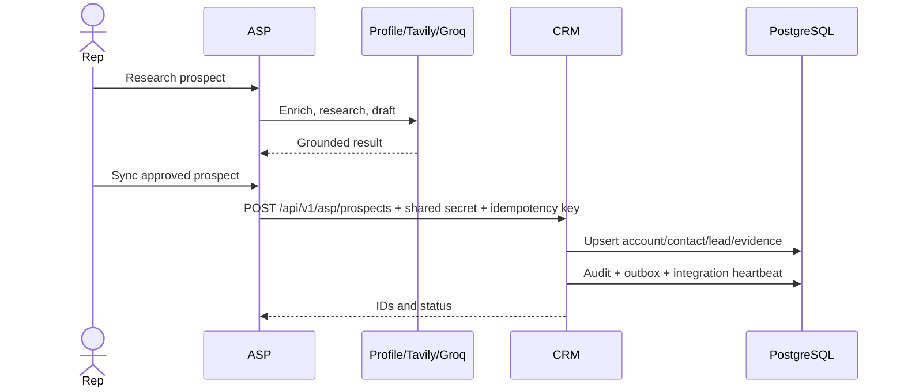
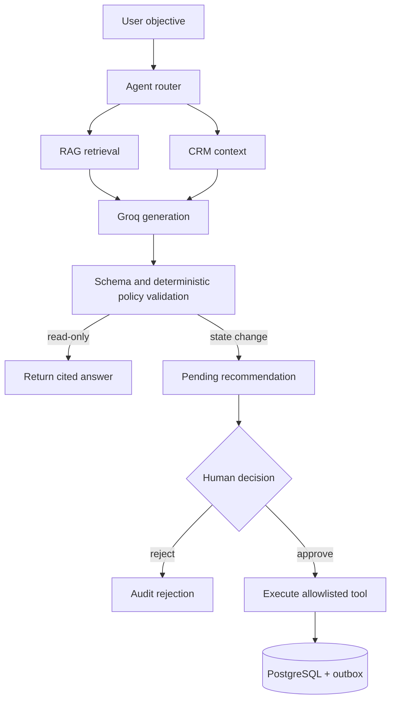
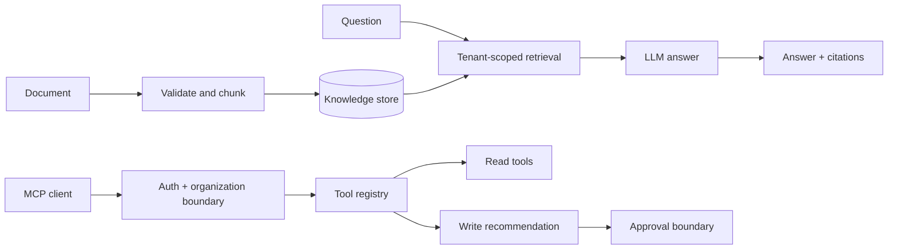

# System flows

## ASP to CRM

```mermaid
sequenceDiagram
  actor Rep
  participant ASP
  participant Providers as Profile/Tavily/Groq
  participant CRM
  participant DB as PostgreSQL
  Rep->>ASP: Research prospect
  ASP->>Providers: Enrich, research, draft
  Providers-->>ASP: Grounded result
  Rep->>ASP: Sync approved prospect
  ASP->>CRM: POST /api/v1/asp/prospects + shared secret + idempotency key
  CRM->>DB: Upsert account/contact/lead/evidence
  CRM->>DB: Audit + outbox + integration heartbeat
  CRM-->>ASP: IDs and status
```

## Governed agent action

```mermaid
flowchart TD
  Q[User objective] --> R[Agent router]
  R --> K[RAG retrieval]
  R --> C[CRM context]
  K --> L[Groq generation]
  C --> L
  L --> V[Schema and deterministic policy validation]
  V -->|read-only| O[Return cited answer]
  V -->|state change| P[Pending recommendation]
  P --> H{Human decision}
  H -->|reject| A[Audit rejection]
  H -->|approve| X[Execute allowlisted tool]
  X --> D[(PostgreSQL + outbox)]
```

## RAG and MCP

```mermaid
flowchart LR
  D[Document] --> I[Validate and chunk]
  I --> S[(Knowledge store)]
  Q[Question] --> RET[Tenant-scoped retrieval]
  S --> RET
  RET --> GEN[LLM answer]
  GEN --> CIT[Answer + citations]
  MCP[MCP client] --> AUTH[Auth + organization boundary]
  AUTH --> REG[Tool registry]
  REG --> READ[Read tools]
  REG --> WRITE[Write recommendation]
  WRITE --> APPROVE[Approval boundary]
```

